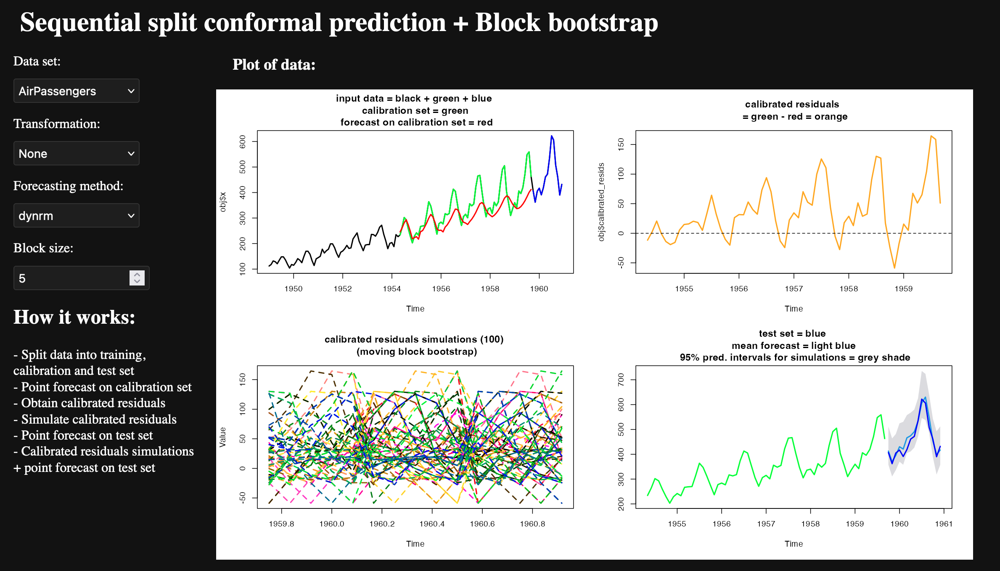

# Sequential split conformal prediction + Block bootstrap for time series 

This is a web app illustrating a recipe (`scp-block-bootstrap`) implemented in [Python package `nnetsauce`](https://thierrymoudiki.github.io/blog/2024/07/03/python/quasirandomizednn/forecasting/nnetsauce-mts-isf2024) for time series forecasting **uncertainty quantification**. 

## How it works:

In R Console, run: 

```R
shiny::runGitHub(repo = "2024-07-17-scp-block-bootstrap", username = "thierrymoudiki")
```

## How it looks like




## Underlying process

- Split data into training, calibration and test set
- Obtain point forecast on calibration set
- Obtain calibrated residuals
- Simulate calibrated residuals using moving block bootstrap
- Obtain Point forecast on test set
- Prediction = Calibrated residuals simulations + point forecast on test set

## See also 

- https://thierrymoudiki.github.io/blog/2024/07/03/python/quasirandomizednn/forecasting/nnetsauce-mts-isf2024
- https://www.researchgate.net/publication/379643443_Conformalized_predictive_simulations_for_univariate_time_series
